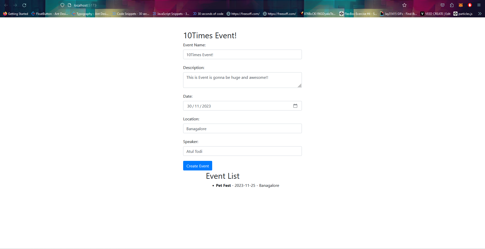
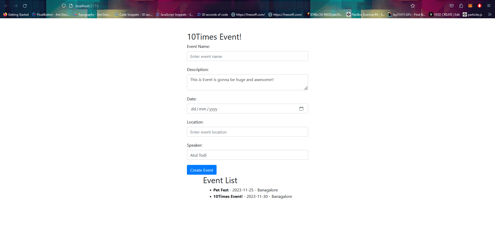

# 10Times Assignment

#Description

Introducing a streamlined event creation form using React, Vite, and Tailwind CSS. This minimalistic interface empowers users to swiftly input event details such as title, date, location, and description. The form ensures a user-friendly experience with real-time validation and a clean layout. Seamlessly blending functionality with aesthetics, this small-scale app simplifies the event creation process, providing a responsive and visually pleasing solution for users to effortlessly organize and share their events.

## Setup Guide
- Clone the project
- Cd to the folder
- Go the project through the terminal and install all dependencies by using typing `npm install` in the terminal
- Run the server using `npm run dev`

## Screenshots

For visualization here's the step by step Guide

### HomePage

### EventList Page

### Demo Link - https://10timesevent.netlify.app/

### Tech Used -
- React
- Bootstrap 
- Tailwind
- Figma
- Vite
